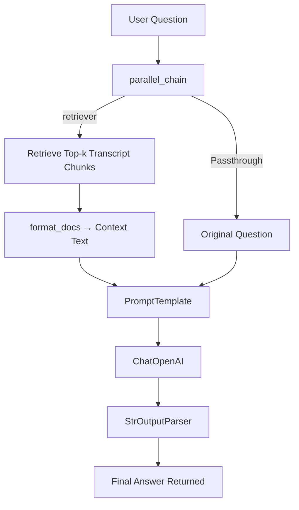

# ✅ YouTube Transcript RAG — README + Architecture Diagram + Flowchart

A clean, professional, copy-ready document containing only:

* ✅ Full README
* ✅ Architecture Diagram (Mermaid)
* ✅ Flowchart (Mermaid)

---

# 📘 **README — YouTube Transcript RAG (LangChain + FAISS + OpenAI)**

## 📌 **Overview**

This project builds a **Retrieval-Augmented Generation (RAG)** pipeline that answers questions *strictly* using the transcript of any YouTube video. It retrieves the transcript, chunks it, embeds using OpenAI embeddings, indexes with FAISS, retrieves relevant chunks, and generates grounded answers with ChatOpenAI.

---

## 🚀 **Features**

✅ Fetch YouTube transcript automatically
✅ Smart text chunking with overlap
✅ Fast vector search using FAISS
✅ Strict grounding (LLM answers only from transcript context)
✅ No hallucination — model says *"I don't know"* if context missing
✅ Clean and modular LangChain pipeline using runnables

---

## 🧩 **Tech Stack**

* **LangChain** (runnables, retriever, prompt templates)
* **OpenAI** (embeddings + chat model)
* **FAISS CPU** (vector index)
* **YouTube Transcript API**
* **Python-dotenv**

---

## 🔧 **Installation**

```bash
pip install -q youtube-transcript-api langchain-community langchain-openai faiss-cpu tiktoken python-dotenv
```

---

## 🔐 **Environment Setup**

Create a `.env` file:

```
OPENAI_API_KEY=your_openai_api_key_here
```

Then load it:

```python
from dotenv import load_dotenv
load_dotenv()
```

---

## 🧠 **RAG Pipeline Steps**

1. **Fetch transcript** using `YouTubeTranscriptApi`.
2. **Flatten** transcript text.
3. **Split** text into overlapping chunks.
4. **Embed chunks** using OpenAI embeddings.
5. **Index embeddings** in FAISS.
6. **Retrieve** relevant chunks for a user question.
7. **Inject** {context} + {question} into PromptTemplate.
8. **Generate grounded answer** using ChatOpenAI.
9. **Parse output** into clean string.

---

# 🏗️ **Architecture Diagram**

```mermaid
flowchart LR
  A[YouTube Video ID] --> B[YouTubeTranscriptApi]
  B -->|Transcript Chunks| C[Flatten Transcript]
  C --> D[Recursive Text Splitter]
  D -->|Chunked Docs| E[OpenAI Embeddings]
  E -->|Vectors| F[FAISS Vector Index]

  G[User Question] --> H[Retriever (FAISS Similarity Search)]
  F --> H

  H --> I[format_docs() → Combined Context]
  I --> J[PromptTemplate]
  G --> J

  J --> K[ChatOpenAI]
  K --> L[StrOutputParser]
  L --> M[Final Answer]
```

---

# 🔄 **Flowchart (End-to-End Workflow)**



---

# ✅ **Ready to Use**

This document is now ready for:

* ✅ GitHub README
* ✅ Viva / Internship Presentation
* ✅ Project submission
* ✅ Portfolio showcase

Agar chaho to isme:
✅ Full code section bhi add kar doon,
✅ Diagrams ko PNG me export kar doon,
✅ Dark theme version bana doon.

Bas bol dena! 🔥
